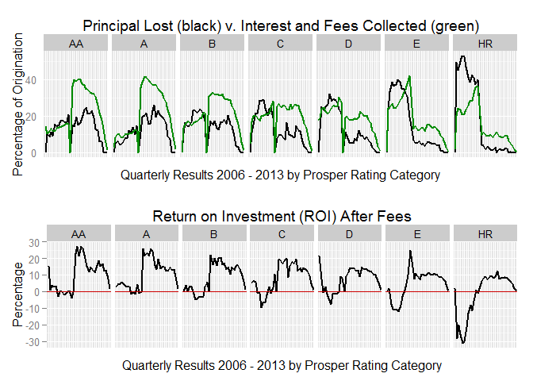

Exploratory Analysis of Prosper.com Loans
========================================================
#### Grace Pehl, PhD
#### Udacity Data Analyst Nanodegree Project 4

[Prosper Loan data](https://docs.google.com/document/d/1qEcwltBMlRYZT-l699-71TzInWfk4W9q5rTCSvDVMpc/pub?embedded=true) provided by Udacity (last updated 3/11/14)

[Prosper.com](https://www.prosper.com/) is a peer-to-peer lending marketplace.  Borrowers make loan 
requests and investors contribute as little as $25 towards the loans of their 
choice. 

Prosper Loan's business history is encoded the the dollar value of the loans originated through their online marketplace.  Prosper was the first peer-to-peer lending marketplace, opening to the public February 5, 2006[[1](https://en.wikipedia.org/wiki/Prosper_Marketplace)].  Initially, lenders bid on loans by offering competing interest rates.  Prosper's business model came under scrutiny by the US Securities and Exchange Commission, who issued a "cease and desist" letter November 24, 2008.[[2](https://www.sec.gov/litigation/admin/2008/33-8984.pdf)]   In anticipation, Prosper filed for SEC registration, which required a "quiet period" from October 15, 2008 until July 13, 2009, during which time, no new loans were originated.[[3](http://www.lendacademy.com/a-look-back-at-the-lending-club-and-prosper-quiet-periods/)]  Prosper attributes the decrease in originations at the end of 2012 to a decrease in liquidity and in January of 2013 undertook an equity financing [[4](https://www.prosper.com/Downloads/Legal/prosper10k12312013.pdf), p 74].  The increase in capital was used in part for a marketing campaign to attract more borrowers and to launch IRA accounts to attract institutional lenders.

In this plot, we switch from dollar amounts to number of new loans originated each quarter and the final disposition of those loans.  The early days of Prosper were marked by very loose lending standards.  Coupled with the global financial crisis, these early loans had very high default rates and many investors realized losses.  After Prosper's relaunch in 2009, minimum credit scores were increased and Prosper made more of an effort to verify borrower's information[[5](http://www.wsj.com/articles/SB120525138644627455)].  Prosper's prospectus makes it clear that investors should expect some loans to default[[6](https://www.prosper.com/invest/marketplace-performance/)], and charges interest rates high enough to account for risk, but lower than a borrower would get from a credit card.

While every rating category experiences defaults, investors make money by collecting more (on average) in interest and fees than the principal lost to defaulting borrowers.  Here, principal lost, service fees, and collection fees are subtracted from the interest and (borrower) fees paid to investors.  All rating categories have generated impressive profits since 2009, with generally higher volatility in riskier categories.  This chart explains why peer-to-peer lending is such a hot topic in investing circles. 
